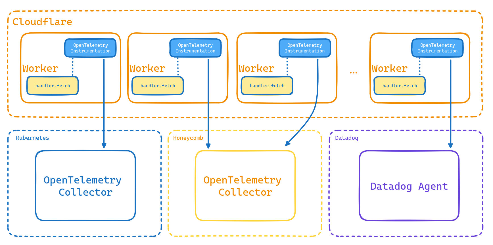

# otel-for-cf-example

[OpenTelemetry](https://opentelemetry.io/) is an open standard and suite of APIs and SDKs that provides functionality for logging, tracing, and metrics across various languages.

[Cloudflare Workers](https://developers.cloudflare.com/workers/) provide a serverless platform for Cloudflare, filled with useful functionality like D1 for SQL, R2 for S3-compatible storage, AI models, and more.

## How It Works

The OpenTelemetry instrumentations are pretty vast- you can look at the [opentelemetry-js-contrib] repository for what is available. This along with the SDK and auto-instrumentation makes it easy to add tracing and much more to your code. Distributed tracing itself is very useful in that you can get a much stronger understanding of what actually occurred during a single transaction across your system. Tracing has certain limitations, but within the scope of a single request, as long as the instrumentation is there you get visibility into specific actions like database queries, cache lookups, HTTP requests, and so much more. This provides a number of benefits for developers, especially in a production environment where your hardening and stability strategies will really be put to the test.

OpenTelemetry does provide support for NodeJS environments, but it does not provide official support for Cloudflare Workers. This is where a useful library comes in: [evanderkoogh/otel-cf-workers](https://github.com/evanderkoogh/otel-cf-workers). With this library, you can instrument a Cloudflare Worker with just a few lines of code. The library is still expanding support for many of the capabilities in Workers, but options like the `fetch` handler and more are already possible. The last key piece to this is running the Cloudflare Workers in NodeJS compatibility mode.

The instrumentation will affect supported handlers in your worker after you wrap it. Then, this instrumentation will send metadata from traces and more to a configured OpenTelemetry Collector. There is an official, open source, and self-hostable collector you can use, but you may also set up a connection with another SaaS provider like Honeycomb or Datadog. The following showcases how this general flow looks, based on where you've configured the target collector:

## Examples

This repository provides the following Cloudflare Worker starter written in TypeScript

- [wrangler-otel](examples/wrangler-otel/)
